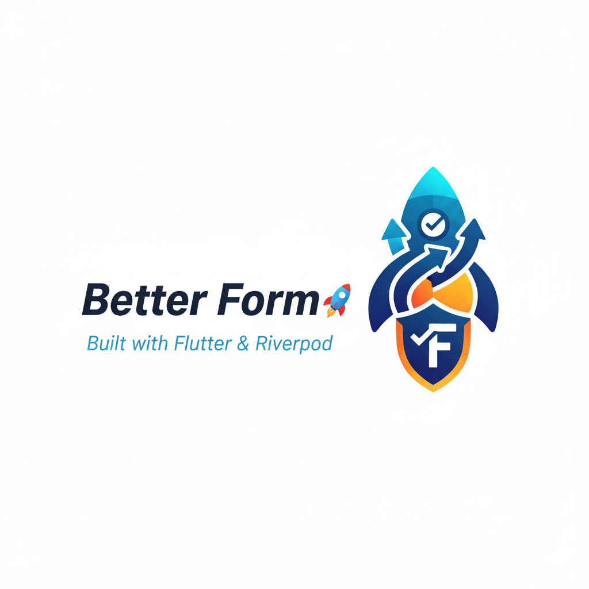

# Better Form 🚀

<p align="center">
  
</p>

An elite, type-safe, and ultra-reactive form engine for Flutter. Powered by Riverpod, Better Form delivers lightning-fast performance and effortless memory management, whether you're building a simple contact form or a massive, multi-section enterprise dashboard.

## 📦 Installation

Add `better_form` to your `pubspec.yaml`:

```yaml
dependencies:
  better_form: ^0.0.1
  flutter_riverpod: ^2.5.1
```

Or run:
```bash
flutter pub add better_form
```

---

## ⚡ Quick Start (For Beginners)

The fastest way to build a type-safe form in 3 minutes.

### 1. Define your fields
```dart
final emailField = BetterFormFieldID<String>('email');
final ageField = BetterFormFieldID<int>('age');
```

### 2. Wrap your app in a Scope
```dart
void main() {
  runApp(const ProviderScope(child: MyApp()));
}
```

### 3. Build the Form
```dart
BetterForm(
  child: Column(
    children: [
      RiverpodTextFormField(
        fieldId: emailField,
        decoration: InputDecoration(labelText: 'Email'),
      ),
      RiverpodNumberFormField(
        fieldId: ageField,
        decoration: InputDecoration(labelText: 'Age'),
      ),
      BetterFormBuilder(
        builder: (context, scope) => ElevatedButton(
          onPressed: () => scope.submit(
            onValid: (values) => print('Saving: $values'),
          ),
          child: Text('Submit'),
        ),
      ),
    ],
  ),
)
```

---

## ✨ Features

- 🔒 **True Type Safety**: No more `map['key'] as String`. Use `BetterFormFieldID<T>`.
- 🚀 **Extreme Performance**: Only the specific field widget rebuilds when its value changes.
- 🗑️ **Zero Memory Leaks**: Controllers are automatically disposed via Riverpod's `autoDispose`.
- 🚥 **Flexible Validation**: Sync, Async, Debounced, and Cross-field rules.
- 🏗️ **Lazy Sections**: Built for massive forms. Register fields only when UI is built.
- 💾 **Persistence**: Built-in support for saving draft state automatically.
- 🎯 **UX First**: Automated scrolling to errors, focus management, and navigation guards.

---

## 📖 Essential Guide

### Defining Field Configuration
While `BetterForm` works with zero setup, you can define rules globally or locally using `BetterFormFieldConfig`.

```dart
BetterForm(
  fields: [
    BetterFormFieldConfig<String>(
      id: emailField,
      label: 'User Email',
      validator: (val) => val.contains('@') ? null : 'Invalid email',
      initialValue: 'guest@example.com',
    ),
  ],
  child: ...
)
```

### Accessing Values & State
Use `BetterFormScope` (via `BetterFormBuilder` or `BetterFormWidget`) for the cleanest API.

```dart
BetterFormBuilder(
  builder: (context, scope) {
    // Reactive: Rebuilds whenever 'age' changes
    final age = scope.watchValue(ageField);

    // Non-reactive: Get value without rebuilt
    final currentAge = scope.getValue(ageField);

    return Text('Age is $age');
  },
)
```

---

## 🛠️ Professional Guide

### 1. Custom Field Implementation
Extend `BetterFormFieldWidget` to create pixel-perfect custom inputs with zero boilerplate.

```dart
class CustomToggleField extends BetterFormFieldWidget<bool> {
  const CustomToggleField({required super.fieldId});

  @override
  Widget buildForm(BuildContext context, BetterFormScope scope) {
    final value = scope.watchValue(fieldId) ?? false;

    return SwitchListTile(
      value: value,
      onChanged: (v) => scope.setValue(fieldId, v),
      title: Text('Toggle Me'),
    );
  }
}
```

### 2. Data Loss Prevention
Use `BetterFormNavigationGuard` to stop users from accidentally navigating away after they've spent time filling out a form.

```dart
BetterForm(
  child: BetterFormNavigationGuard(
    // Shows a default confirmation dialog if form is dirty
    child: MyFormBody(),
  ),
)
```

### 3. Sectional & Lazy Scaling
For huge forms, use `BetterFormSection`. Fields are only registered when they enter the widget tree.

```dart
ListView(
  children: [
    BetterFormSection(
      fields: [ /* Section 1 Configs */ ],
      child: StepOneWidgets(),
    ),
    BetterFormSection(
      fields: [ /* Section 2 Configs */ ],
      child: StepTwoWidgets(),
    ),
  ],
)
```

### 4. Performance Monitoring
During development, use `BetterFormFieldPerformanceMonitor` to ensure your custom widgets aren't rebuilding too often.

```dart
BetterFormFieldPerformanceMonitor<String>(
  fieldId: nameField,
  builder: (context, info, rebuildCount) {
    return Column(
      children: [
        Text('Rebuilds: $rebuildCount'),
        MyWidget(info.value),
      ],
    );
  },
)
```

### 4. Simplified Usage with Builders or Base Classes
Custom widgets can leverage `BetterFormScope` for an effortless development experience. `BetterFormScope` provides high-performance reactive accessors and a powerful `submit` helper.

#### Using `BetterFormBuilder`
```dart
BetterFormBuilder(
  builder: (context, scope) {
    final isValid = scope.watchIsValid;
    final isSubmitting = scope.watchIsSubmitting;

    return ElevatedButton(
      onPressed: (isValid && !isSubmitting)
        ? () => scope.submit(onValid: (values) async => print(values))
        : null,
      child: Text(isSubmitting ? 'Submitting...' : 'Submit'),
    );
  },
)
```

#### Extending `BetterFormWidget`
```dart
class FormStatusPanel extends BetterFormWidget {
  const FormStatusPanel({super.key});

  @override
  Widget buildForm(BuildContext context, BetterFormScope scope) {
    // Rebuilds ONLY when 'name' or validation for 'email' changes
    final name = scope.watchValue(nameField);
    final emailError = scope.watchError(emailField);
    final isValidating = scope.watchIsValidating(emailField);

    return Column(
      children: [
        if (name != null) Text('Welcome, $name'),
        if (isValidating) const CircularProgressIndicator(),
        if (emailError != null) Text(emailError, style: TextStyle(color: Colors.red)),
      ],
    );
  }
}
```

### 5. Dynamic Form Arrays
Manage lists of dynamic inputs easily with `BetterFormArray`.

```dart
final friendsArray = BetterFormArrayID<String>('friends');

BetterFormArray<String>(
  id: friendsArray,
  builder: (context, index, friendId, scope) {
    return Row(
      children: [
        Expanded(child: RiverpodTextFormField(fieldId: friendId)),
        IconButton(
          icon: Icon(Icons.delete),
          onPressed: () => scope.removeArrayItemAt(friendsArray, index),
        ),
      ],
    );
  },
)

// Add new items via scope
scope.addArrayItem(friendsArray, 'New Friend');
```

---

## 🧠 Advanced Features

### 1. Lazy Loading & Sectional Forms
For massive forms (100+ fields), you can organize fields into sections using `BetterFormSection`. This allows:
- **Optimization**: Fields are only registered when the section is built (e.g., when scrolled into view in a `ListView`).
- **Organization**: Cleanly group logical parts of your form.
- **Dynamic Forms**: Easily add/remove entire sets of fields based on user interaction.

```dart
BetterForm(
  child: ListView(
    children: [
      // Standard header
      const Text('Profile Information'),

      // Registered immediately
      BetterFormSection(
        fields: [ firstNameConfig, lastNameConfig ],
        child: Column(children: [ ... ]),
      ),

      const SizedBox(height: 1000), // Long gap

      // Only registered when user scrolls down
      BetterFormSection(
        fields: [ bioConfig, websiteConfig ],
        keepAlive: true, // Keep values even if scrolled out of view
        child: ProfileBioSection(),
      ),
    ],
  ),
)
```

### 2. Cross-Field Dependencies
Use `BetterDependentField` to conditionally render UI based on other field values. This is much more efficient than rebuilding the whole form.

```dart
// Only show the "Spouse Name" field if "Marital Status" is "Married"
BetterDependentField<String>(
  fieldId: maritalStatusField,
  builder: (context, status) {
    if (status == 'Married') {
      return RiverpodTextFormField(
        fieldId: spouseNameField,
        decoration: const InputDecoration(labelText: 'Spouse Name'),
      );
    }
    return const SizedBox.shrink();
  },
)
```

### 3. Programmatic Control
Directly control focus and scrolling within your form through the `BetterFormScope`.

```dart
BetterFormBuilder(
  builder: (context, scope) {
    return Column(
      children: [
        ElevatedButton(
          onPressed: () => scope.focusField(emailField),
          child: Text('Jump to Email'),
        ),
        ElevatedButton(
          onPressed: () => scope.focusFirstError(),
          child: Text('Fix Errors'),
        ),
        ElevatedButton(
          onPressed: () => scope.scrollToField(lastFieldId),
          child: Text('Scroll to Bottom'),
        ),
      ],
    );
  },
)
```

### 2. State Persistence
Automatically save form progress to local storage (or any other source) so users don't lose data on app restart or crash.

Implement the simple `BetterFormPersistence` interface:

```dart
class MyPrefsPersistence implements BetterFormPersistence {
  @override
  Future<void> saveFormState(String formId, Map<String, dynamic> values) async {
    // Save to SharedPreferences / Hive / Database
  }

  // ... implement getSavedState and clearSavedState
}
```

Then attach it to your form:

```dart
BetterForm(
  formId: 'registration_wizard', // Unique ID for this form
  persistence: MyPrefsPersistence(),
  child: ...
)
```

---

## 🚦 Error Handling & Advanced UI

### Focus & Error Management
Guide your users directly to what needs fixing.

```dart
scope.submit(
  onInvalid: (errors) {
    // Automatically focus the first field with an error
    // and scroll it into view.
    scope.focusFirstError();
  },
  onValid: (values) async {
    try {
      await api.save(values);
    } catch (e) {
      // Manually set an error from the server
      scope.setFieldError(emailField, 'Account already exists');
    }
  }
)
```

### Handling Async Validation
Better Form automatically handles the "Validating" state. You can customize the loading UI:

```dart
BetterFormFieldConfig<String>(
  id: usernameField,
  asyncValidator: (val) => checkRepo(val),
  // debouncing is default to 300ms
  debounceDuration: Duration(seconds: 1),
)
```

### Common Pitfalls (Troubleshooting)

| Issue | Solution |
| :--- | :--- |
| **"No BetterForm found"** | Ensure all fields are descendants of a `BetterForm` widget. |
| **"No Material widget found"** | `RiverpodTextFormField` and others require a `Material` / `Scaffold` ancestor. |
| **Field doesn't rebuild** | Ensure you are using `scope.watchValue(id)` or `ref.watch(fieldValueProvider(id))`. |
| **Custom field not registering** | If using `BetterFormFieldWidget`, it registers itself. If building from scratch, use `BetterFormSection` or `controller.registerField`. |

---

### Widgets
- **`BetterForm`**: Root widget context.
- **`BetterFormBuilder`**: Builder widget with controller and state.
- **`BetterFormWidget`**: Base class for custom form widgets.
- **`BetterFormSection`**: Lazy field registration and sectional organization.
- **`RiverpodTextFormField`**: Text input.
- **`RiverpodNumberFormField`**: Numeric input (int/double).
- **`RiverpodCheckboxFormField`**: Boolean checkbox.
- **`RiverpodDropdownFormField`**: Selection from list.
- **`BetterDependentField`**: Reactive builder for dependencies.
- **`RiverpodFormStatus`**: Debug/Status display.

### Classes
- **`BetterFormFieldID<T>`**: Typed identifier key.
- **`BetterFormFieldConfig<T>`**: Configuration (validator, label, initialValue, etc).
- **`BetterFormState`**: The immutable state containing all field values and errors.
- **`RiverpodFormController`**: The brain ensuring state management.

---

## 🤝 Contributing

Contributions are welcome! Please feel free to submit a Pull Request.
